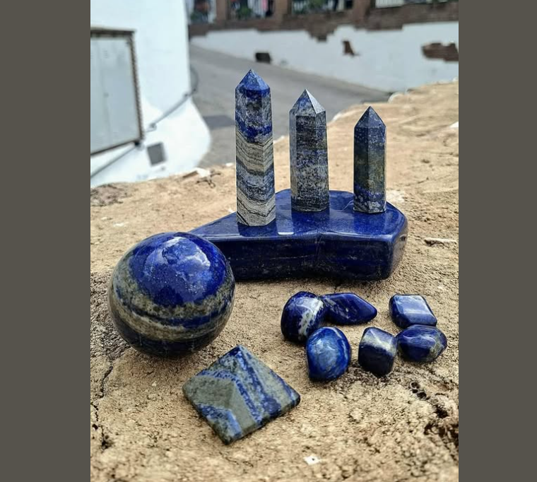

# Valeska López Sepúlveda

## Perfil

**Disciplina / formación:**  Administrador Público
**Qué hago hoy:**  Trabajar, casa y estudios 
**Qué me gustaría aprender en este curso:** Entender un poco este mundo de la programación

## Intereses

- Compras públicas
- Planificación estratégica
- Diseño

## Una pregunta que me interesa explorar

¿El Lapislázuli como material se puede utilizar en manufatura aditiva?

## Algo que me inspira

El desconocimiento tecnico en las licitaciones públicas 

## Links

- [Referencia 1](https://example.com)
- [Referencia 2](https://example.com)

> No es necesario publicar información personal que no quieras compartir. Este README será parte de un repositorio público durante el laboratorio.
